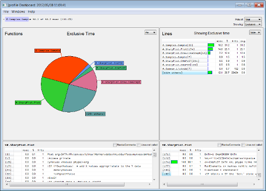

<h1 class="heading"><span class="name">Data Reporting</span></h1>

Once data has been collected, summarised data for each function and line within that function can be retrieved using `⎕PROFILE 'tree'`. In both these cases, a very large quantity of data can be returned.

The `]Profile` user command is a reporting tool that acts on the profiling data collected by the `⎕PROFILE` system function, applying filters and limiting the output to a specified subset of the total collected. This results in a reduced data quantity that is tailored to display only what is required. For details of the syntax of the `]Profile` user command, see [Appendix A](appendix-a-syntax-of-profile-user-command.md)

The examples in this document assume that data has been collected as follows:

```apl
      )LOAD sharpplot
C:\...\ ws\sharpplot.dws saved Mon May  8 09:57:02 2017
      ⎕PROFILE 'start'
      #.Samples.Sample 'Sample.svg'
mySharpPlot  Sample.svg
      ⎕PROFILE 'stop'
```


## Textual Reports

After collecting the data, the consumption by function can be found using:

```apl
      ]Profile summary -expr="#.Samples.Sample 'Sample.svg'" -first=10
Total time: 58.2 msec

Element                           msec       %  Calls
#.Samples.Sample                  58.2   100.0      1
#.SharpPlot.DrawLineGraph         25.6    44.0      1
#.SharpPlot.Plot                  18.4    31.6      1
#.SharpPlot.DrawBarChart           7.7    13.3      1
#.SharpPlot.CH∆PLOT                3.2     5.4      1
#.SharpPlot.DrawPieChart           2.2     3.8      1
#.SharpPlot.CH∆PIE                 1.9     3.3      1
#.SharpPlot.ConstructorDefault     1.3     2.2      1
#.SharpPlot.SharpPlot              1.3     2.2      1
#.psb.Constructor                  1.2     2.1     12
```

In this expression the `-expr` modifier allows the specification of an APL statement to run, and is equivalent to executing:

```apl
      ⎕PROFILE 'clear'
      ⎕PROFILE 'start'
      #.Samples.Sample 'Sample.svg'
      ⎕PROFILE 'stop'
```

The inclusion of `-first=10` limits the output to the top 10 functions in terms of CPU consumption. To see the top 5 lines of code instead:

```apl
      ]Profile summary -lines -first=5
Total time: 58.2 msec
```

```apl
Element                          msec      %  Calls
#.Samples.Sample[33]             25.9   44.5      1
#.Samples.Sample[42]             25.6   44.0      1
#.SharpPlot.DrawLineGraph[43]    25.6   43.9      1
#.SharpPlot.Plot[174]            17.7   30.5      1
#.Samples.Sample[60]              2.2    3.8      1
```

Finally, the call analysis report for the `Constructor` function can be displayed:

```apl
      ]Profile calls -fn=#.psb.Constructor -first=5
 Total time: 58.2 msec; Selected time: 1248.0 msec
```

```apl
Element                 msec     %  Calls
#.SharpPlot.CH∆PLOT      0.4   0.8      3
#.SharpPlot.SharpPlot    0.3   0.6      4
#.SharpPlot.CH∆BAR       0.2   0.3      2
#.SharpPlot.CH∆AXES      0.1   0.2      1
#.SharpPlot.CH∆XTIC      0.1   0.2      1
```

## Graphical Reports

!!! windows "Dyalog on Microsoft Windows"
    >The Dashboard detailed in this section is only available on Microsoft Windows. For information on using the Dashboard, see [Appendix B](appendix-b-dashbord.md)

A graphical version of the textual reports can be viewed using the Dashboard. This provides an overview of the resource consumption of an application that can be drilled down into in pursuit of tuning opportunities.

To open the Dashboard on the dataset, call the `]Profile` user command without
specifying any report type, that is:

```apl
      ]Profile
```

The Dashboard will open and display an  overview of the data currently stored by `⎕PROFILE` (`⎕PROFILE` must  be stopped/inactive), as shown in [](#4-1)

If the dataset is very large then it can take a few seconds to open the Dashboard.

{ #4-1 }

 To open the Dashboard on a dataset that is not currently stored by `⎕PROFILE`, the modifiers `-expr` and/or `-infile` can be included:

* `-expr` runs the specified expression and then opens the Dashboard on the resultant dataset, for example, `]Profile -expr="#.Samples.Sample 'Sample.svg'"`. Doing this destroys any existing `⎕PROFILE` data and replaces it with data for the specified expression.

* `-infile` opens the Dashboard on the dataset contained in the specified <span class="path">.xml</span> file , for example, `]Profile –infile=c:\temp\one.xml`. Doing this does not destroy any existing `⎕PROFILE` data.
