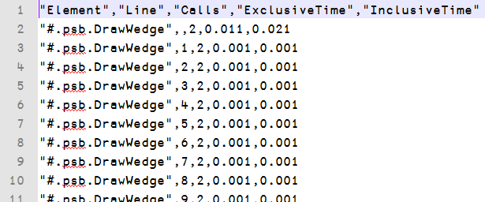
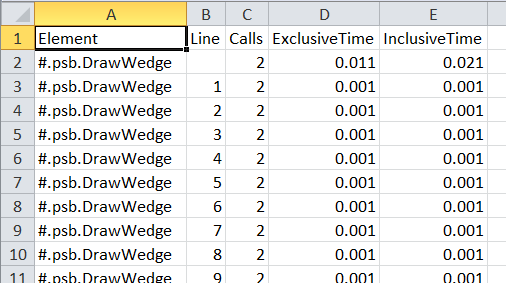

<h1 class="heading"><span class="name">CSV Format</span></h1>

Files saved in CSV format can be used by [`⎕CSV`](../../../language-reference-guide/system-functions/csv) and many external tools. For example:
```apl
      ]Profile data -outfile=c:\temp\data.csv -format=csv -separators='.,'
```
creates a CSV file using a period as the decimal separator and a comma as the field separator. This file can be viewed either by opening it in a text editor or in a spreadsheet (as shown in [](#5-1) and [](#5-2) respectively).

{ #5-1 }

{ #5-2 }

!!! windows "Dyalog on Microsoft Windows"
	[](#5-2) shows the `data.csv` file opened in Microsoft Excel; to do this, enter the following in a Session:
```apl
     'XL' ⎕WC 'OLEClient' 'Excel.Application'
      XL.Visible←1
      XL.Workbooks.Open⊂'c:\temp\data.csv'
```

<h2 class="example">Examples</h2>

This section contains a few examples of output files created using `-format=csv` (all files are encoded as UTF-8). The first row of each file contains column names, selected from the same list as the element names that can appear in XML files (see [XML Format](./xml-format.md)).

```apl
     ]Profile tree -outfile=data1.csv -format=csv
Data written to: data1.csv
```
Content of the `data1.csv` file:
```csv
"Depth","Element","Line","Calls","ExclusiveTime","InclusiveTime"
0,"#.Samples.Sample",¯1,1,19.362,61.828
1,"#.Samples.Sample",1,1,0.002,0.002
1,"#.Samples.Sample",2,1,0,0
1,"#.Samples.Sample",3,1,0,0
1,"#.Samples.Sample",4,1,0,0
1,"#.Samples.Sample",5,1,0.005,0.005
1,"#.Samples.Sample",6,1,0,0
1,"#.Samples.Sample",7,1,0.874,2.388
2,"#.SharpPlot.ConstructorDefault",¯1,1,0.007,1.513
3,"#.SharpPlot.ConstructorDefault",1,1,0,0
3,"#.SharpPlot.ConstructorDefault",2,1,0.001,0.001
3,"#.SharpPlot.ConstructorDefault",3,1,0.004,1.51
4,"#.SharpPlot.SharpPlot",¯1,1,0.219,1.506
...etc...
```

```apl
      ]Profile data -outfile=data2.csv -format=csv -separators=",;"
Data written to: data2.csv
```

Content of the `data2.csv` file:
```csv
"Element";"Line";"Calls";"ExclusiveTime";"InclusiveTime"
"#.psb.DrawWedge";;2;0,011;0,021
"#.psb.DrawWedge";1;2;0,001;0,001
"#.psb.DrawWedge";2;2;0,001;0,001
"#.psb.DrawWedge";3;2;0,001;0,001
"#.psb.DrawWedge";4;2;0,001;0,001
"#.psb.DrawWedge";5;2;0,001;0,001
"#.psb.DrawWedge";6;2;0,001;0,001
"#.psb.DrawWedge";7;2;0,001;0,001
"#.psb.DrawWedge";8;2;0,001;0,001
"#.psb.DrawWedge";9;2;0,001;0,001
...etc...
```
```apl
      ]Profile summary -first=5 -outfile=data3.csv -format=csv
Data written to: data3.csv
```
Content of the `data3.csv` file:

```csv
"Element","Line","Time","PctOfTot","Calls"
"#.Samples.Sample",,58.2,100,1
"#.SharpPlot.DrawLineGraph",,25.626,44.03092784,1
"#.SharpPlot.Plot",,18.373,31.56872852,1
"#.SharpPlot.DrawBarChart",,7.726,13.27491409,1
"#.SharpPlot.CH∆PLOT",,3.153,5.417525773,1
```
