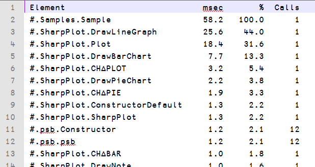

<h1 class="heading"><span class="name">Text Format</span></h1>

If the text format is used, the output is written to the file as it would have been displayed in the Session. The content of such plain text files can then be further processed using external text processing tools, or manipulated using APL (after using [`⎕NGET`](../../../language-reference-guide/system-functions/nget) to import it).

```apl
      ]Profile summary
 Total time: 58.2 msec
```

```text
Element                           msec       %  Calls
#.Samples.Sample                  58.2   100.0      1
#.SharpPlot.DrawLineGraph         25.6    44.0      1
#.SharpPlot.Plot                  18.4    31.6      1
#.SharpPlot.DrawBarChart           7.7    13.3      1
#.SharpPlot.CH∆PLOT                3.2     5.4      1
#.SharpPlot.DrawPieChart           2.2     3.8      1
#.SharpPlot.CH∆PIE                 1.9     3.3      1
#.SharpPlot.ConstructorDefault     1.3     2.2      1
#.SharpPlot.SharpPlot              1.3     2.2      1
#.psb.Constructor                  1.2     2.1     12
#.psb.psb                          1.2     2.1     12
#.SharpPlot.CH∆BAR                 1.0     1.8      1
#.SharpPlot.DrawNote               1.0     1.6      1
#.SharpPlot.CH∆XLAB                0.9     1.6      1
#.SharpPlot.RunElements            0.9     1.6      2
#.SharpPlot.CH∆NOTE                0.9     1.6      1
#.psb.MeasureEach                  0.9     1.5      8
#.SharpPlot.CH∆METRIC              0.9     1.5      7
#.Common.ListAdd                   0.8     1.4    152
#.SharpPlot.CH∆HEAD                0.8     1.3      2
```

```apl
      ]Profile summary -outfile=data.txt -format=txt
Data written to: data.txt
```


