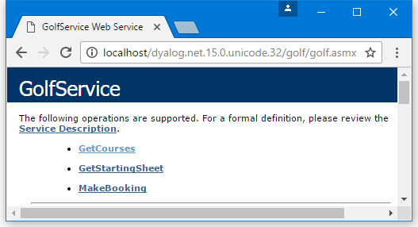
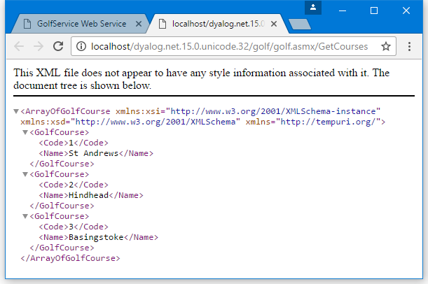
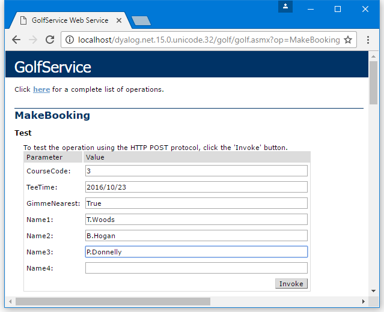
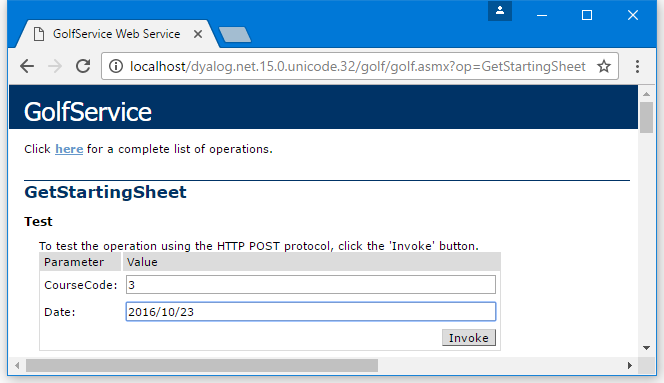
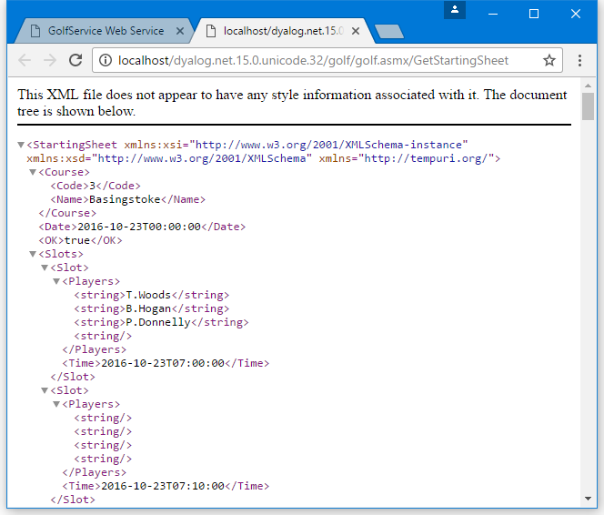

<h1 class="heading"><span class="name">Sample Web Service: GolfService</span></h1>

`GolfService` is an example Web Service that resides in the directory `samples\asp.net\Golf` and is associated with the IIS Virtual Directory `dyalog.net/Golf`. This example makes extensive use of internal classes to define data structures that are appropriate for a client application, such as C# or VB.

The directory contains a `global.asax` script, which is used to initialise the application.

The Golf Web Service example manages the reservation of tee-times at golf courses. All the data is held in a component file called `GolfData.dcf`. This file may be initialised using the function `Golf.INITFILE` in the workspace `samples\asp.net\webservices\webservices.dws`. You may need to alter the file path first.

Each golf course managed by the application has a unique code (integer) and a name (string). This is handled by defining a class (structure) called `GolfCourse` with two fields, `Code` and `Name`.

`GolfService` provides 3 methods:
```apl
GetCourses()
```

Returns a list of Golf Courses (CourseCode and CourseName). The result of this method is an array of `GolfCourse` objects.

```apl
GetStartingSheet(CourseCode,Date)
```

Returns the starting sheet for a specified golf course on a given day. A starting sheet is a list of starting times with a list of the golfers booked to start their round at that time. The result of this method is a `StartingSheet` object.

```apl
MakeBooking(CourseCode,TeeTime,GimmeNearest, Name1,Name2,Name3,Name4))
```

Requests a tee reservation at the course specified by `CourseCode`. `TeeTime` is a `DateTime` object that specifies the requested date and time. `GimmeNearest` is `Boolean`. If 1, requests the nearest tee-time to that specified; if 0, requests only the specified tee-time. Name1-4 are strings specifying up to 4 players. Note that all parameters are required. The result of this method is a `Booking` object.

## GolfService: Global.asax
```apl
<script language="Dyalog" runat=server>
 
∇ Application_Start;GOLFID
  :Access Public
  GOLFID←'c:\Dyalog\samples\asp.net\golf\GolfData' ⎕FTIE 0[^1]
  Application[⊂'GOLFID']←GOLFID
∇
 
∇ Application_End;GOLFID
  :Access Public
  :Trap 6
      GOLFID←Application[⊂'GOLFID']
      ⎕FUNTIE GOLFID
  :EndTrap
∇
</script>
```

The `Application_Start` function is called when the `GolfService` Web Service is invoked for the first time. It ties the `GolfData` component file then stores the tie number in a new Item called `GOLFID` in the Application object. This item is then subsequently available to methods in the `GolfService` for the duration of the application.

The `Application_End` function is invoked when the `GolfService` Web Service terminates. It unties the `GolfData` component file.

This example may be considered slightly weak in that the location of the data file is hard-coded in the application's `Global.asax` file. An alternative is to store this information in the `<appsettings>` section of the appropriate `web.config` file or in the global `machine.config` file. This is preferable if the resource (in this case a file name) is to be accessed from more than one script. For further information on ASP.NET *config* files, see the documentation for the .NET Framework SDK.

Note that the `GolfData` file may be initialised using the function `Golf.INITFILE` in the `samples\asp.net\webservices\webservices.dws` workspace. The function will prompt you for the path of the file, initialize it and update the `Global.asax` file accordingly.

## GolfService: GolfCourse class

The `GolfCourse` class is effectively a structure with two fields named `Code` and `Name`. `Code` is an integer code that provides a shorthand way to refer to a specific golf course; `Name` is a `String` containing its full name.
```apl
:Class GolfCourse
    :Access Public
    :Field Public Int32 Code
    :Field Public String Name
 
    ∇ ctor args
     :Implements Constructor
     :Access public
     :Signature fn Int32, String
      Code Name←args
    ∇
    ∇ ctor_def 
     :Implements Constructor
     :Access public
      ctor ¯1 ''
    ∇
:EndClass
```

The `GolfCourse` class provides two constructors. The first, named `ctor_def`, takes no arguments and therefore overrides the default constructor that is inherited from `System.Object`. `ctor_def` calls `ctor` to initialise the instance with a Code of  `¯1` and an empty Name.

The constructor named `ctor` accepts two parameters named `CourseCode` (an integer) and `CourseName` (a string), and simply assigns these values into the corresponding fields.

Therefore, valid ways to create an instance of a `GolfCourse` are:
```apl
      GC←⎕NEW GolfCourse
      GC.(Code Name)←1 'St Andrews'
```

Or, more simply
```apl
      GC←⎕NEW GolfCourse (1 'St Andrews') 
```

Note that the names of the constructor functions are not visible outside the class. Constructors are identified by their signatures (basically, the `:Implements Constructor` statement) and not by their names.

## GolfService: Slot class

The `Slot` class is effectively a structure with two fields named `Time` and `Players`. `Time` is a `DateTime` object that represents a time that can be reserved on the first tee. `Players` is an array of (up to 4) strings that contains the names of the golfers who have reserved to start their round of golf at that time.
```apl
:Class Slot
    :Access Public
    :Field Public DateTime Time
    :Field Public String[] Players
 
    ∇ ctor1 arg
     :Implements Constructor
     :Access public
     :Signature fn DateTime
      Time←arg
      Players← 0⍴⊂''
    ∇
    ∇ ctor2 args
     :Implements Constructor
     :Access public
     :Signature fn DateTime, String[]
      Time Players←args
    ∇
    ∇ ctor_def 
     :Implements Constructor
     :Access public
    ∇
:EndClass
```

This class provides two constructor functions named `ctor1` and `ctor2`. However, for internal reasons, if a class defines any constructor functions, it is currently necessary to provide a dummy default constructor (the form of the constructor that takes no parameters); hence `ctor_def`.

The constructor `ctor1` accepts a single `DateTime` parameter, which it assigns to the Time, field, and initialises the `Players` field to an empty array.

The constructor `ctor2` accepts two arguments, a specified tee time, and an array of strings that contains golfers' names. It assigns these parameters to `Time` and `Players` respectively.

## GolfService: Booking class

The `Booking` class represents the result of the `MakeBooking` method. It contains 4 fields named `OK`, `Course`, `TeeTime` and `Message`.

`OK` is `Boolean` and indicates whether or not the attempt to make a reservation was successful. If `OK` is false (0), the `Message` field (a string) indicates the reason for failure.

If `OK` is true (1) the `Course` field contains an instance of a `GolfCourse` object, and the `TeeTime` field contains an instance of a `Slot` object. Together, these objects identify the reserved golf course and starting slot. The latter specifies both the starting time, and the names of all the golfers who have been allocated that starting time and who will therefore play together.
```apl
:Class Booking
    :Access Public
    :Field Public Boolean OK
    :Field Public GolfCourse Course
    :Field Public Slot TeeTime
    :Field Public String Message
 
    ∇ ctor args
     :Implements Constructor
     :Access public
     :Signature fn Boolean, GolfCourse, Slot, String
      OK Course TeeTime Message←args
    ∇
    ∇ ctor_def 
     :Access public
     :Implements Constructor
    ∇
:EndClass
```

This class provides a single constructor method, which must be called with values for all four fields.

## GolfService: StartingSheet class

The `StartingSheet` class represents the result of the `GetStartingSheet` method. It contains 5 fields named `OK`, `Course`, `Date`, `Slots` and `Message`. `OK` is `Boolean` and indicates whether or not a starting sheet is available for the specified course and date.

If `OK` is false (0), the `Message` field (a string) indicates the reason for failure.

If `OK` is true (1) the `Course` field contains an instance of a `GolfCourse` object, the `Date` field contains the date in question, and the `Slots` field contains an array of `Slot` objects. Each `Slot` object specifies a starting time and the names of golfers who are booked to play at that time.
```apl
:Class StartingSheet
    :Access Public
    :Field Public Boolean OK
    :Field Public GolfCourse Course
    :Field Public DateTime Date
    :Field Public Slot[] Slots
    :Field Public String Message
 
    ∇ ctor args
     :Implements Constructor
     :Access public
     :Signature fn Boolean, GolfCourse, DateTime
      OK Course Date←args
    ∇
 
    ∇ ctor_def 
     :Implements Constructor
     :Access public
    ∇
:EndClass
```

Like the `Booking` class, the `StartingSheet` class provides a single constructor method. In this case, the constructor is called with values for just 3 of the fields; the values of the other fields are expected to be assigned later.

## GolfService: GetCourses function
```apl
     ∇ R←GetCourses;COURSECODES;COURSES;INDEX;GOLFID
[1]   ⍝
[2]   :Access WebMethod
[3]   :Signature GolfCourse[]←fn
[4]   
[5]    GOLFID←Application[⊂'GOLFID']
[6]    COURSECODES COURSES INDEX←⎕FREAD GOLFID 1
[7]    R←⎕NEW¨GolfCourse,¨⊂¨↓⍉↑COURSECODES COURSES
     ∇
```

The `GetCourses` function retrieves the tie number of the `GolfData` component file from the `Application` object and reads its first component.

The function then creates a `GolfCourse` object for each of the courses recorded on the file, and returns the array of `GolfCourse` objects as its result.

## GolfService: GetStartingSheet function

The `GetStartingSheet` function retrieves the tie number of the `GolfData` component file from the `Application` object and reads its first component. Line [10] creates an instance of a `StartingSheet` object and uses it to initialise the result `R`. The value of the `OK` field is set to zero to indicate failure.

It then validates the requested `CourseCode`. If invalid, it simply sets the `Message` field in the result and returns it. Similarly, it checks to see if there is a starting sheet on file for the requested date. If not, it sets the `Message` field to indicate this, and returns.

Note that line [15] extracts the `Year`, `Month` and `Day` properties from the requested tee time, a `DateTime` object, and converts them to an IDN. This is used to index the component containing the starting sheet for that day.

```apl
     ∇ R←GetStartingSheet ARGS;CODE;COURSE;DATE;GOLFID;
       COURSECODES;COURSES;INDEX;COURSEI;IDN;DATES;COMPS;
       IDATE;TEETIMES;GOLFERS;I;T
[1]   ⍝
[2]   :Access WebMethod
[3]   :Signature StartingSheet←fn Int32 CCode,
                                  DateTime Date
[4]  
[5]    CODE DATE←ARGS
[6]    GOLFID←Application[⊂'GOLFID']
[7]    COURSECODES COURSES INDEX←⎕FREAD GOLFID 1
[8]    COURSEI←COURSECODES⍳CODE
[9]    COURSE←⎕NEW GolfCourse (CODE(COURSEI⊃COURSES,⊂''))
[10]   R←⎕NEW StartingSheet (0 COURSE DATE)
[11]   :If COURSEI>⍴COURSECODES
[12]       R.Message←'Invalid course code'
[13]       :Return
[14]   :EndIf
[15]   IDN←2 ⎕NQ'.' 'DateToIDN',DATE.(Year Month Day)
[16]   DATES COMPS←⎕FREAD GOLFID,COURSEI⊃INDEX
[17]   IDATE←DATES⍳IDN
[18]   :If IDATE>⍴DATES
[19]       R.Message←'No Starting Sheet available'
[20]       :Return
[21]   :EndIf
[22]   TEETIMES GOLFERS←⎕FREAD GOLFID,IDATE⊃COMPS
[23]   R.OK←1
[24]   T←⎕NEW¨DateTime,¨⊂¨(⊂DATE.(Year Month Day)),¨
                  3↑¨↓[1]24 60⊤TEETIMES
[25]   R.Slots←⎕NEW¨Slot,¨⊂¨T,∘⊂¨↓GOLFERS
     ∇
```

Line[23] sets the `OK` field of the result to 1 (success).

Line[24] converts the stored tee times (in minutes) to `DateTime` objects.

Line[25] combines the tee times and golfers into a vector of 2-element arrays, and creates a `Slot` object for each of them. The result is assigned to the `Slots` field of the result `R`.

## GolfService: MakeBooking function

The `MakeBooking` function checks that the requested tee-time is available, for the specified number of players and updates the starting sheet accordingly. The result of the function is a `Booking` object.

`MakeBooking` first retrieves the tie number of the `GolfData` component file from the Application object and reads its first component.

Lines[13 14] create instances of `GolfCourse` and `Slot` objects, which at this stage are not validated. Line[15] then initialises the result `R`, a `Booking` object, which includes these instances. At this stage, `R.OK` is 0 indicating failure.

Line[16] validates the requested `CourseCode`, and, if invalid, simply sets `R.Message` and returns.

Similarly, lines [20 23] check that the requested tee time is within the next 30 days from now. If not, the function assigns the appropriate error message to `R.Message` and returns. Note that these two statements employ the APL primitive function `>` (rather that the `op_GreaterThan` method) to compare the requested tee time (a `DateTime` object) with a new `DateTime` object that represents *now* and *now+30 days* respectively.

Notice that line[24] uses the `AddDays` method to create a new `DateTime` object that represents *now + 30 days*. An alternative expression, to get *now+30* days is:
```apl
      TEETIME.Now+⎕NEW TimeSpan (30 0 0 0)
```

Lines[28-47] are concerned with retrieving the appropriate component from the file, initialising it or re-using an old one, if it is not present. Each component represents the starting sheet for a particular course on a particular day.

Lines[48-63] check whether or not the requested slot is available (for the specified number of golfers). If not it returns an error message as before or, if `GimmeNearest` is 1 (true), it attempts to allocate the slot closest to the requested time.

If an appropriate slot is found, Lines[72 73] update the `Slot` object with the assigned time and names of the golfers. Line[74] then inserts the modified `Slot` object into the result, and sets the `OK` field to 1 (true) to indicate success.

```apl
    ∇ R←MakeBooking ARGS;CODE;COURSE;SLOT;TEETIME;GOLFID;
                    COURSECODES;COURSES;INDEX;COURSEI;IDN;
                    DATES;COMPS;IDATE;TEETIMES;GOLFERS;
                    OLD;COMP;HOURS;MINUTES;NEAREST;TIME;
                    NAMES;FREE;FREETIMES;I;J;DIFF
[1]  ⍝
[2]   :Access WebMethod
[3]   :Signature Booking←Int32 CourseCode,
                         DateTime TeeTime,
                         Boolean GimmeNearest,
                         String Name1,
                         String Name2,
                         String Name3,
                         String Name4
[4] 
[5]  
[6]  ⍝ If GimmeNearest=0, books (or fails) for specified time
[7]  ⍝ If GimmeNearest=1, books (or fails) for nearest to
                                           specified time
[8]  
[9]    CODE TEETIME NEAREST←3↑ARGS
[10]   GOLFID←Application[⊂'GOLFID']
[11]   COURSECODES COURSES INDEX←⎕FREAD GOLFID 1
[12]   COURSEI←COURSECODES⍳CODE
[13]   COURSE←⎕NEW GolfCourse,⊂CODE(COURSEI⊃COURSES,⊂'')
[14]   SLOT←⎕NEW Slot TEETIME
[15]   R←⎕NEW Booking (0 COURSE SLOT '')
[16]   :If COURSEI>⍴COURSECODES
[17]       R.Message←'Invalid course code'
[18]       :Return
[19]   :EndIf
[20]   :If TEETIME.Now>TEETIME
[21]       R.Message←'Requested tee-time is in the past'
[22]       :Return
[23]   :EndIf
[24]   :If  TEETIME>TEETIME.Now.AddDays 30
[25]       R.Message←'Requested tee-time is more than
                      30 days from now'
[26]       :Return
[27]   :EndIf
[28]   IDN←2 ⎕NQ'.' 'DateToIDN',TEETIME.(Year Month Day)
[29]   DATES COMPS←⎕FREAD GOLFID,COURSEI⊃INDEX
[30]   IDATE←DATES⍳IDN
[31]   :If IDATE>⍴DATES
[32]       TEETIMES←(60×7)+10ׯ1+⍳1+8×6
                    ⍝ 10 minute intervals, 07:00 to 15:00
[33]       GOLFERS←((⍴TEETIMES),4)⍴⊂''
                    ⍝ up to 4 golfers allowed per tee time
[34]       :If 0=OLD←⊃(DATES<
                  2 ⎕NQ'.' 'DateToIDN',3↑⎕TS)/⍳⍴DATES
[35]           COMP←(TEETIMES GOLFERS)⎕FAPPEND GOLFID
[36]           DATES,←IDN
[37]           COMPS,←COMP
[38]           (DATES COMPS)⎕FREPLACE GOLFID,COURSEI⊃INDEX
[39]       
```
```apl
           :Else
[40]           DATES[OLD]←IDN
[41]           (TEETIMES GOLFERS)⎕FREPLACE
                                 GOLFID,COMP←OLD⊃COMPS
[42]           DATES COMPS ⎕FREPLACE GOLFID,COURSEI⊃INDEX
[43]       :EndIf
[44]   :Else
[45]       COMP←IDATE⊃COMPS
[46]       TEETIMES GOLFERS←⎕FREAD GOLFID COMP
[47]   :EndIf
[48]   HOURS MINUTES←TEETIME.(Hour Minute)
[49]   NAMES←(3↓ARGS)~⍬''
[50]   TIME←60⊥HOURS MINUTES
[51]   TIME←10×⌊0.5+TIME÷10 ⍝ Round to nearest
                              10-minute interval
[52]   :If ~NEAREST
[53]       I←TEETIMES⍳TIME
[54]       :If I>⍴TEETIMES
[55]       :OrIf (⍴NAMES)>⊃,/+/0=⍴¨GOLFERS[I;]
[56]           R.Message←'Not available'
[57]           :Return
[58]       :EndIf
[59]   :Else
[60]       :If ~∨/FREE←(⍴NAMES)≤⊃,/+/0=⍴¨GOLFERS
[61]           R.Message←'Not available'
[62]           :Return
[63]       :EndIf
[64]       FREETIMES←(FREE×TEETIMES)+32767×~FREE
[65]       DIFF←|FREETIMES-TIME
[66]       I←DIFF⍳⌊/DIFF
[67]   :EndIf
[68]   J←(⊃,/0=⍴¨GOLFERS[I;])/⍳4
[69]   GOLFERS[I;(⍴NAMES)↑J]←NAMES
[70]   (TEETIMES GOLFERS)⎕FREPLACE GOLFID COMP
[71]   TEETIME←⎕NEW DateTime,⊂TEETIME.(Year Month Day),
                                   3↑24 60⊤I⊃TEETIMES
[72]   SLOT.Time←TEETIME
[73]   SLOT.Players←(⊃,/0<⍴¨GOLFERS[I;])/GOLFERS[I;]
[74]   R.(OK TeeTime)←1 SLOT
  ∇
```

## Testing GolfService from a Browser

If you point your browser at the URL:
```apl
 http://localhost/dyalog.net.15.0.unicode.32/Golf/Golf.asmx
```

`GolfService` will be compiled and ASP.NET will fabricate a page about it for the browser to display as shown below.

The three methods exposed by `GolfService` are listed.



Invoking the `GetCourses` method generates the following output.

Notice that the data type of the result is `ArrayOfGolfCourse`, and the data type of each element of the result is `GolfCourse`. Furthermore, the public fields defined for the `GolfCourse` object are clearly named.

All this information is derived from the declarations in the `Golf.asmx` script.

As supplied, the `GolfData` component file contains only 3 golf courses as shown below.



ASP.NET generates a Form containing fields that allow the user to invoke the `MakeBookings` method as shown below.

Notice the way a `DateTime` value is specified. Note too that the `GimmeNearest` parameter is `Boolean`, so you must enter `"True"`" or `"False"`. If you enter 0 or 1, it will cause an error and the application will refuse to try to call `MakeBookings` because you have specified the wrong type for a parameter.

When you try this yourself, remember to enter a date that is within the next 30 days, and a time between 07:00 and 15:00. Alternatively, you may wish to experiment with invalid data to check the error handling.



The result of invoking `MakeBooking` with this data is shown below.

Notice how all the information about the `Booking` object structure, including the structure of the sub-objects, is provided.


The following picture shows data suitable for invoking the `GetStartingSheet` method.

If you try this for yourself, choose a course and date on which you have made at least one successful booking.



Finally, the result of the `GetStartingSheet` function is illustrated below.

The output clearly shows that the result, a `StartingSheet` object, contains an array of `Slot` objects, each of which contains a `Time` field and a `Players` field.



### Using GolfService from C#

The `csharp` sub-directory in `samples\asp.net\golf` contains sample files for accessing the `GolfService` Web Service from C#. The C# source code in `Golf.cs` is shown below.
```apl
using System;

class MainClass  {

	static void Main(String[] args)
		{
		GolfService golf = new GolfService();
		int nArgs = args.Length;
		Booking booking;

		booking=golf.MakeBooking(
/* Course Code 	  */	1,
/* Desired Tee Time */	DateTime.Parse(args[0]),
/* nearest is OK    */	true,
/* player 1		  */	(nArgs > 1) ? args[1] : "",
/* player 2		  */	(nArgs > 2) ? args[2] : "",
/* player 3		  */	(nArgs > 3) ? args[3] : "",
/* player 4		  */	(nArgs > 4) ? args[4] : ""
			);

		Console.WriteLine(booking.OK);
		Console.WriteLine(booking.TeeTime.Time.ToString());
		foreach (String player in booking.TeeTime.Players)
			Console.WriteLine(player);
		}
}

```

The following example shows how you may run the `C#` program `golf.exe` from a Command Prompt window. Please remember to specify a reasonable date and time rather than the one used in this example.
```apl
csharp>golf 2006-08-07T08:00:00 T.Woods A.Palmer P.Donnelly
True
25/08/2008 08:00:00
T.Woods
A.Palmer
P.Donnelly

csharp>

```

[^1]: This file needs to be located where it can be modified.
