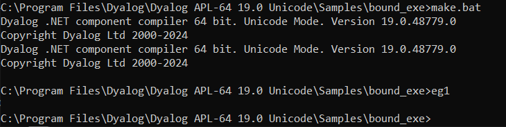
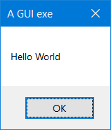
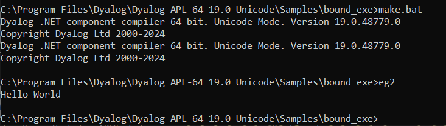

# Creating Programs (.exe) with APL Source Files

This section is specific to the Microsoft Windows operating system only.

The following examples, which illustrate how you can create an executable program (**.exe**) directly from an APL Source file, can be found in the **[DYALOG]/Samples/bound_exe** directory. The examples require write access to successfully build the samples, therefore Dyalog Ltd recommends copying the **[DYALOG]/Samples/bound_exe** directory to somewhere you have write access.

Example: Simple GUI

The **eg1.apln** APL Source file illustrates the simplest possible GUI application that displays a message box containing the string "Hello World":
```apl
:Namespace N
⎕LX←'N.RUN' 
∇RUN;M 
'M'⎕WC'MsgBox' 'A GUI exe' 'Hello World'
⎕DQ'M' 
∇ 
:EndNamespace
```

The code must be contained within `:NameSpace` and `:EndNamespace` statements, and must define a `⎕LX` either within the APL Source file itself or as a parameter to the `dyalogc` command. In this example, `⎕LX` is defined within the APL Source file.

This  is compiled to a Windows executable (**.exe**) using **make.bat** and run from the same command window.



Compiling and running APL Source file **eg1.apln**



"Hello World" Message Box (**eg1.exe**)

The resulting executable can be associated with a desktop icon, and will run without a command prompt window. Any default APL output that would normally be displayed in the session window will be ignored.

Example: Simple Console

The **eg2.apln** APL Source file illustrates the simplest possible application that displays the text "Hello World".:
```apl
:Namespace N
⎕LX←'N.RUN'
∇RUN
'Hello World'
∇
:EndNamespace
```

The code must be contained within `:NameSpace` and `:EndNamespace` statements, and must define a `⎕LX` either in the APL Source file itself or as a parameter to the `dyalogc` command. In this example, `⎕LX` is defined within the APL Source file.

This  is compiled to a Windows executable (**.exe**) using **make.bat** and run from the same command window. The `/console` flag in **make.bat** instructs the Dyalog .NET Compiler to create a console application that runs from a command prompt. In this case, default APL output that would normally be displayed in the Session window is instead displayed in the command window from which the program was run.



Compiling and running APL Source file **eg2.apln**
