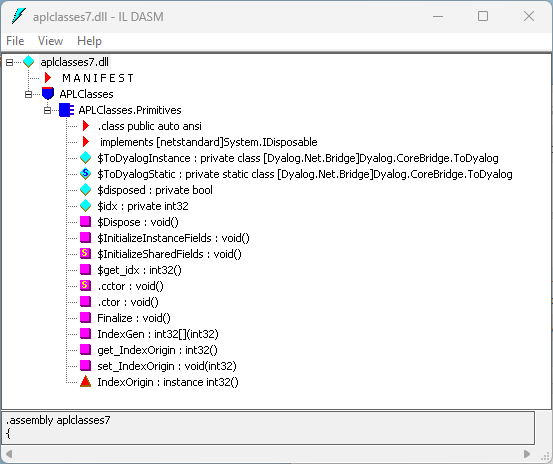

# Defining Properties

Properties are defined within `:Property` and `:EndProperty` statements. A property pertains to the class in which it is defined.

Within a `:Property` block, you must define the accessors of the property. The accessors specify the code that is associated with referencing and assigning the value of the property. No other function definitions or statements are allowed inside a `:Property` block.

The accessor used to reference the value of the property is represented by a function called `get` that is defined within the `:Property` block. The accessor used to assign a value to the property is represented by a function called `set` that is defined within the `:Property` block.

The `get` function is used to retrieve the value of the property and must be a niladic result returning function. The data type of its result determines the `Type` of the property. The `set` function is used to change the value of the property and must be a monadic function with no result. The argument to the function will have a data type `Type` specified by the `:Signature` statement. A property that contains a `get` function but no `set` function is effectively a read-only property.

Example
```apl
:Property Name
     ∇ C←get
[1]   :Access public
[2]   :Signature Double←get
[3]    C←...
     ∇
:EndProperty
```

This declares a new property called `Name` whose data type is System.Double. When defining a property, the data type can be any valid .NET type that can be located through `⎕USING`.

The APL Source file **[DYALOG]/Samples/aplclasses/aplclasses7/aplclasses7.apln** shows how a property called `IndexOrigin` can be added to this example. Within the `:Property` block there are two functions called `get` and `set`; these functions use the previously‑described fixed names and syntax, and are used to reference and assign a new value respectively:
```apl
:Namespace APLClasses
```
```apl

:Class Primitives: Object
⎕USING←,⊂'System'
:Access public
```
```apl

∇ R←IndexGen N
:Access Public
:Signature Int32[]←IndexGen Int32 number
R←⍳N
∇
```
```apl

:Property IndexOrigin
∇io←get
      :Signature Int32←get Int32 number
io←⎕IO
∇
```
```apl

∇set io
      :Signature set Int32 number
:If io∊0 1
    ⎕IO←io
:EndIf
∇
```
```apl

:EndProperty
:EndClass
:EndNamespace
```

The `ILDASM` view of the new **aplclasses7.dll**, showing the new `IndexOrigin` property, is shown below.



ILDASM view of aplclasses7.dll structure

As with other .NET classes, this .NET class can be called from APL. For example:
```apl
      )CLEAR
clear ws
      ⎕USING←'APLClasses,[DYALOG]/Samples/aplclasses/aplclasses7/net/aplclasses7.dll'
      APL←⎕NEW Primitives
      APL.IndexGen 10
1 2 3 4 5 6 7 8 9 10
```
```apl

      APL.IndexOrigin
1
```
```apl
      APL.IndexOrigin←0
      APL.IndexGen 10
0 1 2 3 4 5 6 7 8 9
```
