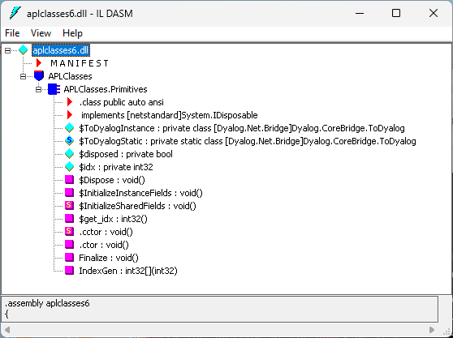

# Example: Creating A .NET Class Using an APL Source File

The following code illustrates how you can create a .NET Class using an APL Source file. The example class is the same as in [Section ](dotnet-classes-eg1.md). The APL Source file **[DYALOG]/Samples/aplclasses/aplclasses6/aplclasses6.apln** is:
```apl
:Namespace APLClasses
```
```apl

:Class Primitives: Object
⎕USING←,⊂'System'
:Access public
```
```apl

∇ R←IndexGen N
:Access Public
:Signature Int32[]←IndexGen Int32 number
R←⍳N
∇
:EndClass
```
```apl

:EndNamespace
```

This APL Source file code defines a namespace called `APLClasses`. This namespace acts as a container and is there to establish a .NET namespace of the same name within the resulting .NET assembly. Within `APLClasses` is a .NET class called `Primitives` whose base class is `System.Object`. This class has a single public method named `IndexGen`, which takes a parameter called `number` whose data type is `Int32`, and returns an array of `Int32` as its result.

The following command shows how **aplclasses6.apln** is compiled to a .NET assembly using the `/t:library`  flag.
```
aplclasses6> dyalogc.exe /t:library aplclasses6.apln
Dyalog .NET Compiler 64 bit. Unicode Mode. Version 19.0.48666.0
Copyright Dyalog Ltd 2000-2024
aplclasses6>
```

The image below
 shows a view of the resulting **aplclasses6.dll** using ILDASM.



ILDASM view of aplclasses6.dll structure

As with other .NET classes, this .NET class can be called from APL. For example:
```apl
      )CLEAR
clear ws
      ⎕USING←'APLClasses,[DYALOG]/Samples/aplclasses/aplclasses6/net/aplclasses6.dll'
      APL←⎕NEW Primitives
      APL.IndexGen 10
1 2 3 4 5 6 7 8 9 10
```
