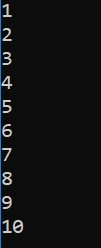

# Example 1

As write access is required to successfully build the samples, this example assumes that you have copied the **[DYALOG]/Samples/aplclasses** directory to **<your_dir>**, where you have write access.

Load the **aplclasses1.dws** workspace from **<your_dir>/aplclasses1**, then view the `Primitives` class:
```apl
      )ED APLClasses.Primitives
```
```apl

:Class Primitives
:using System
∇R←IndexGen N
:access public
:signature Int32[]←IndexGen Int32
R←⍳N
∇
:EndClass ⍝ Primitives
```

`Primitives` contains one public method/function, called `IndexGen`.

The public characteristics for the exported method are included in the definition of the class and its functions, as specified in the `:Signature` statement. This has the following syntax:
```apl
:Signature [rslttype←] name [arg1type [arg1name] [,argNtype [argNname]]*]
```

where:

- `rslttype` is the type of the result returned by the function – in this example, the function returns an array of 32-bit integers

- `name` is the exported name (it can be different from the APL function name but it must be provided) – in the example, the name of the exported method is `IndexGen`

- `argNtype [argNname]` are any arguments are to be supplied, each type-name pair separated from the next by a comma. In this example, the function takes a single integer as its argument.

For more information on `:Signature`, see the Dyalog Programming Reference Guide.

When the class is fixed, APL will try to find the .NET data types that have been specified for the result and for the parameters. If one or more of the data types are not recognised as available .NET types, then a warning will be displayed in the status window and APL will not fix the class. If you see such a warning, you have either entered an incorrect data type name, or you have not set `:using` correctly, or some other syntax problem has been detected (for example, the function could be missing a terminating `∇`). In this example, the only data type used is `System.Int32`; as `:using System` is included in the definition, `Int32` is correctly located.

In earlier versions of Dyalog, the statements `:Returns` and `:ParameterList` were used instead of `:Signature`. They are still accepted for backwards compatibility reasons, but are considered deprecated.
## aplclasses1

The C# source code (**<your_dir>/aplclasses1/net/project/Program.cs**) can be used to call the Dyalog.NET class. The `using` statements specify the names of .NET namespaces to be searched for unqualified class names. The program creates an object called `apl` of type `Primitives` by calling the `new` operator on that class. Then it calls the `IndexGen` method with a parameter of 10.
```
      using System;
      using APLClasses;
      public class MainClass
          {
          public static void Main()
              {
                  Primitives apl = new Primitives();
                  int[] rslt = apl.IndexGen(10);
                  for (int i=0;i<rslt.Length;i++)
                  Console.WriteLine(rslt[i]);
              }
          }
```

To compile the C# source code

1. On the command line, navigate to **<your_dir>/aplclasses1/net**.
2. Run **build** (Linux and macOS)/**build.bat** (Microsoft Windows).This invokes the  Dyalog script compiler to  compile **aplclasses1.dws** to  **aplclasses1.dll**, and then invokes the C# compiler to compile the C# source code (**Program.cs**)  to produce an executable called **project.exe** in **<your_dir>/aplclasses1/net/project/bin/Debug/net8.0**.

The output when the program is run is displayed in a console window:



Program output in console window
