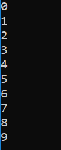

# Example 2

As write access is required to successfully build the samples, this example assumes that you have copied the **[DYALOG]/Samples/aplclasses** directory to **<your_dir>**, where you have write access.

In [Section ](dotnet-classes-eg1.md), APL supplied a default constructor, which was used to create an instance of the Primitives class. It was inherited from the base class (`System.Object`) and called without arguments. This example extends that by adding  a constructor that specifies the value of `⎕IO`.

Load the **aplclasses2.dws** workspace from **<your_dir>/aplclasses2**, then view the `Primitives` class:
```apl
      ↑⎕SRC APLClasses.Primitives
:Class Primitives                      
:Using System                          
                                       
    ∇ CTOR IO                          
      :Implements constructor          
      :Access public                   
      :Signature CTOR Int32 IO         
      ⎕IO←IO                           
    ∇                                  
                                       
    ∇ R←IndexGen N                     
      :Access public                   
      :Signature Int32[]←IndexGen Int32
      R←⍳N                             
    ∇                                  
                                       
:EndClass ⍝ Primitives                 

```

This version of `Primitives` contains a constructor function called `CTOR` which sets `⎕IO` to the value of its argument. The name of this function is arbitrary.

## aplclasses2

The C# source code (**<your_dir>/aplclasses2/net/project/Program.cs**) can be used to call the new version of the Dyalog .NET class:
```
      using System;
      using APLClasses;
      public class MainClass
            {
            public static void Main()
                  {
                  Primitives apl = new Primitives(0);
                  int[] rslt = apl.IndexGen(10);

                  for (int i=0;i<rslt.Length;i++)
                  Console.WriteLine(rslt[i]);
                  }
            }
```

The program is the same as in the previous example (see [Section ](dotnet-classes-eg1.md)), except that the code that creates an instance of the `Primitives` class now specifies an argument; in this example, 0.

To compile the C# source code

1. On the command line, navigate to **<your_dir>/aplclasses2/net**.
2. Run **build** (Linux and macOS)/**build.bat** (Microsoft Windows).This invokes the  Dyalog script compiler to  compile **aplclasses2.dws** to  **aplclasses2.dll**, and then invokes the C# compiler to compile the C# source code (**Program.cs**)  to produce an executable called **project.exe** in **<your_dir>/aplclasses2/net/project/bin/Debug/net8.0**.

The output when the program is run is displayed in a console window: – the amended line numbers show the effect of changing the index origin from 1 (the default) to 0.



Program output in console window
