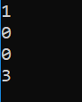

# Example 4

As write access is required to successfully build the samples, this example assumes that you have copied the **[DYALOG]/Samples/aplclasses** directory to **<your_dir>**, where you have write access.

This example builds on [Section ](dotnet-classes-eg3.md), and illustrates how you can implement constructor overloading by establishing several different constructor functions.

For this example, when a client application creates an instance of the `Primitives` class, is should be able to specify either the value of `⎕IO` or the values of both `⎕IO` and `⎕ML`. The simplest way to implement this is to have two public constructor functions, `CTOR1` and `CTOR2`, which call a private constructor function, `CTOR`.

Load the **aplclasses4.dws** workspace from **<your_dir>/aplclasses4**; the new version of the `Primitives` class includes the following additions:
```apl

     ∇ CTOR1 IO
[1]    :Implements constructor
[2]    :Access public
[3]    :Signature CTOR1 Int32 IO
[4]    CTOR IO 0
     ∇
```
```apl
     ∇ CTOR2 IOML
[1]    :Implements constructor
[2]    :Access public
[3]    :Signature CTOR2 Int32 IO,Int32 ML
[4]    CTOR IOML
     ∇
```
```apl
     ∇ CTOR IOML;EX
[1]    IO ML←IOML
[2]    :If ~IO∊0 1
[3]        EX←⎕NEW ArgumentException,⊂⊂'IndexOrigin must be 0 or 1'
[4]        EX ⎕SIGNAL 90
[5]    :EndIf
[6]    :If ~ML∊0 1 2 3
[7]        EX←⎕NEW ArgumentException,⊂⊂'MigrationLevel must be 0, 1, 2 or 3'
[8]        EX ⎕SIGNAL 90
[9]    :EndIf
[10]   ⎕IO ⎕ML←IO ML
     ∇ 
```

The `:Signature` statements for these three functions show that `CTOR1` is defined as a constructor that takes a single `Int32` parameter and `CTOR2` is defined as a constructor that takes two `Int32` parameters; `CTOR` has no .NET properties defined. In .NET terminology, `CTOR` is not a private constructor but rather an internal function that is invisible to the outside world.

Next, a function called `GetIOML` is defined and exported as a public method. This function returns the current values of `⎕IO` and `⎕ML`:
```apl
     ∇ r←GetIOML
[1]   :access public
[2]   :signature Int32[]←GetIOML
[3]   r←⎕IO ⎕ML
     ∇
```

## aplclasses4

The C# source code (**<your_dir>/aplclasses4/net/project/Program.cs**) contains code to invoke the two different constructor functions `CTOR1` and `CTOR2`:
```
using System;
using APLClasses;
public class MainClass
	{
	public static void Main()
		{
		Primitives apl10 = new Primitives(1);
		int[] rslt10 = apl10.GetIOML();
		for (int i=0;i<rslt10.Length;i++)
			Console.WriteLine(rslt10[i]);

		Primitives apl03 = new Primitives(0,3);
		int[] rslt03 = apl03.GetIOML();
		for (int i=0;i<rslt03.Length;i++)
			Console.WriteLine(rslt03[i]);
		}
	}
```

This code creates two instances of the `Primitives` class called `apl10` and `apl03`; the first is created with a constructor parameter of `(1)`, and the second with two constructor parameters `(0,3)`.

The C# compiler matches the first call with `CTOR1`, because `CTOR1` is defined to accept a single `Int32` parameter. The second call is matched to `CTOR2`, because `CTOR2` is defined to accept two `Int32` parameters.

To compile the C# source code

1. On the command line, navigate to **<your_dir>/aplclasses4/net**.
2. Run **build** (Linux and macOS)/**build.bat** (Microsoft Windows).This invokes the  Dyalog script compiler to  compile **aplclasses4.dws** to  **aplclasses4.dll**, and then invokes the C# compiler to compile the C# source code (**Program.cs**)  to produce an executable called **project.exe** in **<your_dir>/aplclasses4/net/project/bin/Debug/net8.0**.

The output when the program is run is displayed in a console window:



Program output in console window
