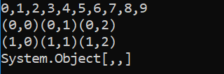

# Example 5

As write access is required to successfully build the samples, this example assumes that you have copied the **[DYALOG]/Samples/aplclasses** directory to **<your_dir>**, where you have write access.

This example builds on [Section ](dotnet-classes-eg4.md), and illustrates how you can implement method overloading.

In this example, the requirement is to export three different versions of the `IndexGen` method; one that takes a single number as an argument, one that takes two numbers, and a third that takes any number of numbers. These are represented by three functions called `IndexGen1`, `IndexGen2` and `IndexGen3` respectively. The index generator function (monadic `⍳`) performs all of these operations, therefore the three APL functions are identical. However, their public interfaces, as defined in their `:Signature` statement, are all different. The overloading is achieved by entering the same name for the exported method (`IndexGen`) for each of the three APL functions.

Load the **aplclasses5.dws** workspace from **<your_dir>/aplclasses5**; the new version of the `Primitives` class includes three different versions of `IndexGen`. The first is the version we have seen before, which is defined to take a single argument of type `Int32` and to return a 1-dimensional array (vector) of type `Int32`:
```apl
     ∇ R←IndexGen1 N
[1]   :Access public
[2]   :Signature Int32[]←IndexGen Int32 N
[3]    R←⍳N
     ∇
```

The second version is defined to take two arguments of type `Int32` and to return a 2‑dimensional array, each of whose elements is a 1-dimensional array (vector) of type `Int32`:
```apl
     ∇ R←IndexGen2 N
[1]   :Access public
[2]   :Signature Int32[][,]←IndexGen Int32 N1, Int32 N2
[3]    R←⍳N
     ∇
```

Although we could define seven more different versions of the method, taking 3, 4, 5 (and so on) numeric parameters, instead this method is defined more generally to take a single parameter that is a 1-dimemsional array (vector) of numbers, and to return a result of type `Array`. In practice we might use this version alone, but for a C# programmer, this is harder to use than the two other specific cases:
```apl
     ∇ R←IndexGen3 N
[1]   :Access public
[2]   :Signature Array←IndexGen Int32[] N
[3]   R←⍳N
     ∇
```

All these functions use the same descriptive name, `IndexGen`.

A function can have several `:Signature` statements. As the three functions perform exactly the same operation, we could replace them with a single function:```apl
     ∇ R←IndexGen1 N
[1]   :Access public
[2]   :Signature Int32[]←IndexGen Int32 N
[3]   :Signature Int32[][,]←IndexGen Int32 N1, Int32 N2
[4]   :Signature Array←IndexGen Int32[] N
[5]    R←⍳N
     ∇
```

## aplclasses5

The C# source code (**<your_dir>/aplclasses5/net/project/Program.cs**) contains code to invoke the three different variants of `IndexGen` in the new **aplclasses.dll**. It uses a local sub-routine `PrintArray()`:
```
      using System;
      using APLClasses;
      public class MainClass
            {
            static void PrintArray(int[] arr)
            {
                  for (int i=0;i<arr.Length;i++)
                      {
                      Console.Write(arr[i]);
                      if (i!=arr.Length-1)
                         Console.Write(",");
                      }
            }
            
            public static void Main()
                  {
                  Primitives apl = new Primitives(0);
                  int[] rslt = apl.IndexGen(10);
                  PrintArray(rslt);
                  Console.WriteLine("");
                  int[,][] rslt2 = apl.IndexGen(2,3);

                  for (int i=0;i<2;i++)
                           {
                           for (int j=0;j<3;j++)
                                    {
                                    int[] row = rslt2[i,j];
                                    Console.Write("(");
                                    PrintArray(row);
                                    Console.Write(")");
                                    }
                  Console.WriteLine("");
                           }

                  int[] args = new int[3];
                  args[0]=2;
                  args[1]=3;
                  args[2]=4;
                  Array rslt3 = apl.IndexGen(args);
                  Console.WriteLine(rslt3);

            }

```

To compile the C# source code

1. On the command line, navigate to **<your_dir>/aplclasses5/net**.
2. Run **build** (Linux and macOS)/**build.bat** (Microsoft Windows).This invokes the  Dyalog script compiler to  compile **aplclasses5.dws** to  **aplclasses5.dll**, and then invokes the C# compiler to compile the C# source code (**Program.cs**)  to produce an executable called **project.exe** in **<your_dir>/aplclasses5/net/project/bin/Debug/net8.0**.

The output when the program is run is displayed in a console  window:



Program output in console window
