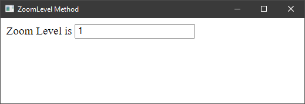
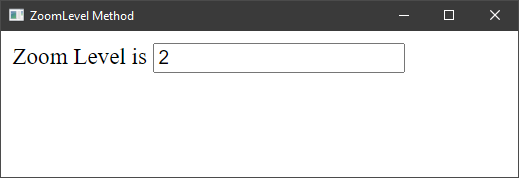
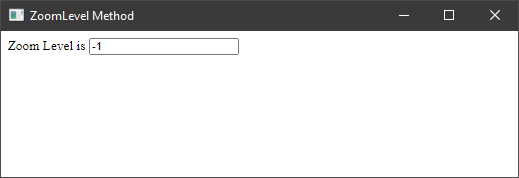

<h1 class="heading"><span class="name">SetZoomLevel</span> <span class="command">Method</span></h1>

|-----------|--------------------------------------------------------------|
|Applies To:|[HTMLRenderer](https://help.dyalog.com/19.0/index.htm#GUI/Objects/HTMLRenderer.htm)|

**Description**

Sets the CEF ZoomLevel. The default (unzoomed) level is 0. Setting a positive value will increase the zoom, whereas setting a negative will decrease the zoom. The zoom scale is not linear; rather the effective scaling is approximately 1.2*level, so, setting the ZoomLevel to 1 will result in an approximate 20% size increase. ZoomLevel affects all instances of HTMLRenderer windows; it is not possible to have different ZoomLevels for individual windows.

The argument to SetZoomLevel is a single numeric value:

|-----|---------|-------|
|`[1]`|ZoomLevel|Numeric|

<h2 class="example">Examples</h2>
```apl
     ∇ hr Zoom level;lb;in
[1]    hr.SetZoomLevel level
[2]    level←⍕hr.GetZoomLevel
[3]    ((level='¯')/level)←'-'
[4]    lb←'<label>Zoom Level is </label>'
[5]    in←'<input type="number" value="',level,'"></input>'
[6]    hr.HTML←lb,in
     ∇

```
```apl
      hr.⎕WC'HTMLRenderer' ('Caption' 'ZoomLevel Method')
      hr Zoom 0
```


```apl
      hr Zoom 1
```



```apl
      hr Zoom 2
```



```apl
      hr Zoom ¯1
```


