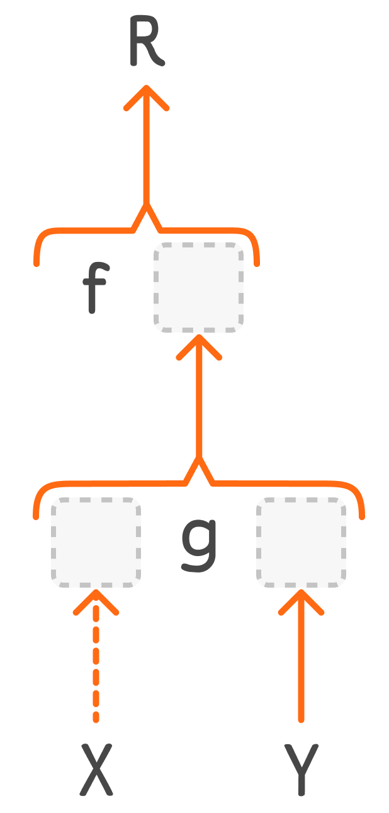
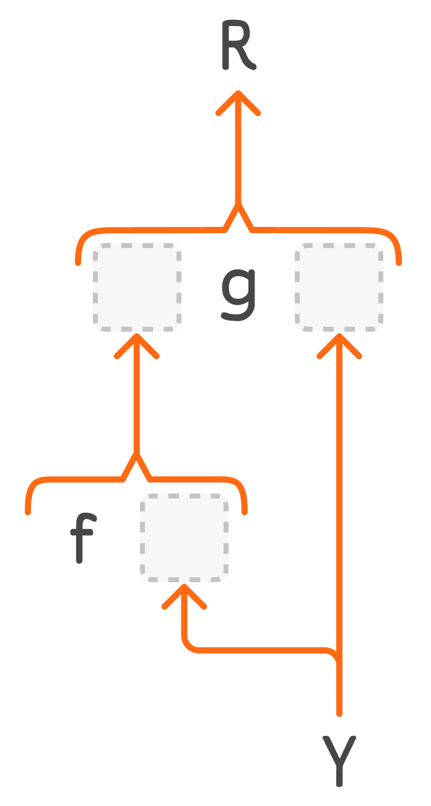
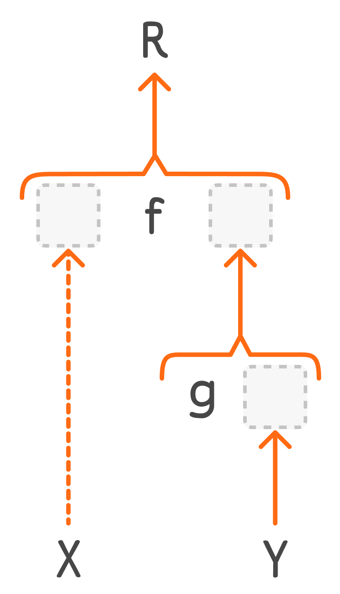

<h1 class="heading">Function Composition</h1>

Function composition refers to the "gluing" together of two functions using a dyadic operator such that the functions are applied to the argument(s) as normal, but in a particular pattern specific to the operator that is being used. The term _function composition_ comes from traditional mathematics, where it is used for a function `h(x)=f(g(x))` when written as  `h(x)=(f∘g)(x)` APL generalises this idea to dyadic functions, allowing various patterns of application in addition to the simple application of one monadic function to the result of another monadic function. The four main patterns, represented by _atop_, _behind_, _beside_, and _over_, can be visualised as shown below.

!!! Info "Information"
    In the diagrams below, the dotted branch falls away when the operator is applied monadically.
    Note that monadic _atop_, _beside_, and _over_ are all equivalent to each other and to `h(x)=(f∘g)(x)` of traditional mathematics.

_Atop_: `{R}←{X}f⍤g Y`

{: style="max-height: 16em"}

_Behind_: `{R}←{X}f⍛g Y`

{: style="max-height: 16em"}

{: style="max-height: 16em"}

_Beside_: `{R}←{X}f∘g Y`

{: style="max-height: 16em"}

_Over_: `{R}←{X}f⍥g Y`

{: style="max-height: 16em"}
