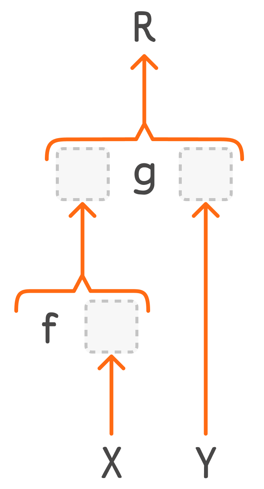
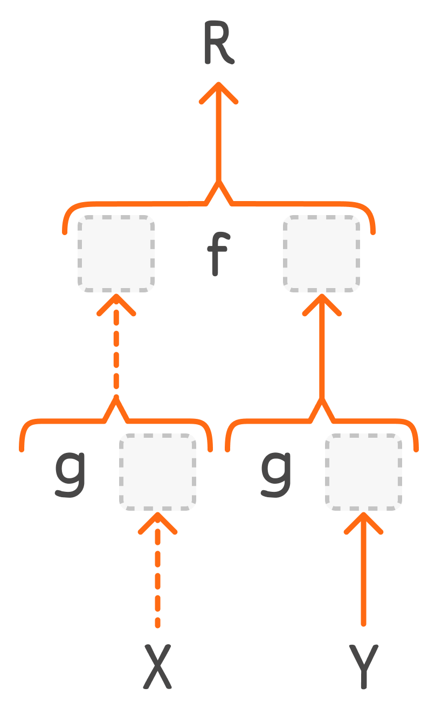

<h1 class="heading"><span class="name">Operator Syntax</span></h1>

Operators take one or two operands.  An operator with one operand is monadic.  The operand of a monadic operator is to the left of the operator.  An operator with two operands is dyadic.  Both operands are required for a dyadic operator.

Operators have long scope to the left.  That is, the left operand is the longest function or array expression to its left (see [Programmer's Guide: "Operators"](../../../programming-reference-guide/introduction/operators)). A dyadic operator has short scope on the right.  Right scope may be extended by the use of parentheses.

An operand may be an array, a primitive function, a system function, a defined function or a derived function. An array may be the result of an array expression.

An operator with its operand(s) forms a derived function. The derived function may be monadic or dyadic and it may or may not return an explicit result.

<h2 class="example">Examples</h2>
```apl
      +/⍳5
15
      (*∘2)⍳3
1 4 9
 
      PLUS ← + ⋄ TIMES ← ×
      1 PLUS.TIMES 2
2
 
      ⎕NL 2
A
X
      ⎕EX¨↓⎕NL 2
      ⎕NL 2
```

## Monadic Operators

Like primitive functions, monadic operators can be:

- named
- enclosed within parentheses
- displayed in the session

<h3 class="example">Examples</h3>
```apl
      ⎕ ← each ← (¨)      ⍝ name and display
¨
      shape←⍴
      shape each (1 2) (3 4 5)
 2  3 
      
      slash←/
      +slash ⍳10
55
      swap←⍨
      3 -swap 4
1
```

## Right Operand Currying

A dyadic operator may be bound or *curried* with its right operand to form a monadic operator:

<h4 class="example">Examples</h4>
```apl
      ⎕ ← inv ← ⍣¯1  ⍝ produces monadic inverse operator
⍣ ¯1
      +\inv 1 2 3    ⍝ scan-inverse
1 1 1
      lim ← ⍣≡       ⍝ power-limit

      1 +∘÷lim 1     ⍝ Phi
1.61803
```

## Function Composition

Function composition refers to the "gluing" together of two functions using a dyadic operator such that the functions are applied to the argument(s) as normal, but in a particular pattern specific to the operator that is being used. The term _function composition_ comes from traditional mathematics, where it is used for a function `h(x)=f(g(x))` when written as  `h(x)=(f∘g)(x)` APL generalises this idea to dyadic functions, allowing various patterns of application in addition to the simple application of one monadic function to the result of another monadic function. The four main patterns, represented by _atop_, _behind_, _beside_, and _over_, can be visualised as shown below.

!!! Info "Information"
    In the diagrams below, the dotted branch falls away when the operator is applied monadically.
    Note that monadic _atop_, _beside_, and _over_ are all equivalent to each other and to `h(x)=(f∘g)(x)` of traditional mathematics.

_Atop_: `{R}←{X}f⍤g Y`

{: style="max-height: 16em"}

_Behind_: `{R}←{X}f⍛g Y`

{: style="max-height: 16em"}


{: style="max-height: 16em"}

_Beside_: `{R}←{X}f∘g Y`

{: style="max-height: 16em"}

_Over_: `{R}←{X}f⍥g Y`

{: style="max-height: 16em"}
