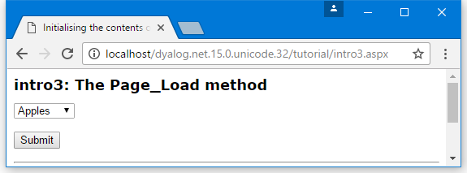

<h1 class="heading"><span class="name">The Page_Load Event</span></h1>

`Intro3.aspx` illustrates how you can dynamically initialise the contents of a Web Page using the Page_Load event. This example also introduces another type of Web Control, the `DropDownList` object.
```
<%@Register TagPrefix="tutorial" Namespace="Tutorial" Assembly="tutorial" %>
<script language="Dyalog" runat="server">

∇Page_Load 
:Access Public
list.Items.Add ⊂'Apples'
list.Items.Add ⊂'Oranges'
list.Items.Add ⊂'Bananas'
∇

∇Select (obj ev)
:Access Public
:Signature Select Object obj, EventArgs ev
out.Text←'You selected ',list.SelectedItem.Text
∇
</script>

<html>
<head>
<title>Initialising the contents of the Page using the Page_Load method</title>
<link rel="stylesheet" type="text/css" href="apl.css">
</head>

<body>
<h1>intro3: The Page_Load method</h1>
<form runat="server">
<asp:DropDownList id="list" runat="server"/>
<p>
<asp:Label id="out" runat="server" />
</p>
<asp:Button id="btn" 
	Text="Submit"
	runat="server"
	OnClick="Select"/>
</form>
<tutorial:index runat="server"/>
</body>
</html>
```

When an ASP.NET web page is loaded, it generates a `Page_Load` event. You can use this event to perform initialisation simply by defining a public function called `Page_Load` in your `APLScript`. This function will automatically be called every time the page is loaded. The `Page_Load` function should be niladic.

Note that, if the page employs the technique illustrated in `Intro1.aspx`, whereby the page is continually POSTed back to itself by user interaction, your `Page_Load` function will be run every time the page is loaded and you may not wish to repeat the initialisation every time. Fortunately, you can distinguish between the initial load, and a subsequent load caused by the post back, using the `IsPostBack` property. This property is inherited from the `System.Web.UI.Page` class, which is the base class for any `.aspx` page.

The `Page_Load` function in this example checks the value of `IsPostBack`. If 0 (the page is being loaded for the first time) it initialises the contents of the `list` object, adding 3 items "Apples", "Oranges" and "Bananas". The explanation for the statement:
```apl
      list.Items.Add ⊂'...'
```

is that the `DropDownList` WebControl has an `Items` property that is a collection of `ListItem` objects. The collection implements an `Add` function that takes a `String` Argument that can be used to add an item to the list.

Notice that the name of the object `list` is defined by the `id="list"` attribute of the `DropDownList` control that is defined in the page layout section of the page.



In this example, the page is processed by a POST back caused by pressing the `Submit` button. As it stands, changing the selection in the `list` object does not cause the text in the `out` object to be changed; you have to press the `Submit` button first.


However, you can make this happen automatically by adding the following attributes to the `list` object (see `intro4.aspx`):

```xml
AutoPostback="true"
OnSelectedIndexChanged="Select"/>
```

`AutoPostback` causes the object to generate HTML that will provoke a post back whenever the selection is changed. When it does so, the `OnSelectedIndexChanged` event will be generated in the server-side script which in turn will call `Select`, which in turn will cause the text in the out object to change.

Note that this technique, which can be used with most of the ASP.NET controls including CheckBox, RadioButton and TextBox controls, relies on a round trip to the server every time the value of the control changes. It will not perform well except on a fast connection to a lightly loaded server.
