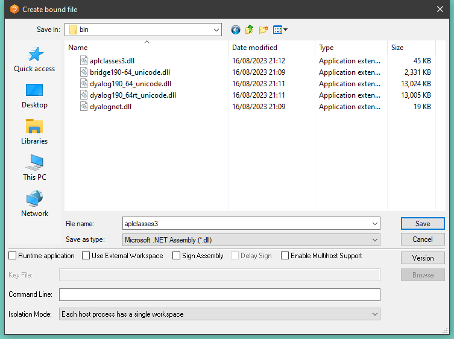
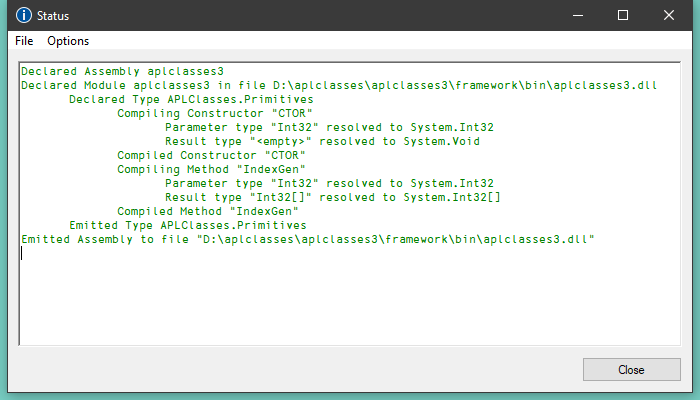
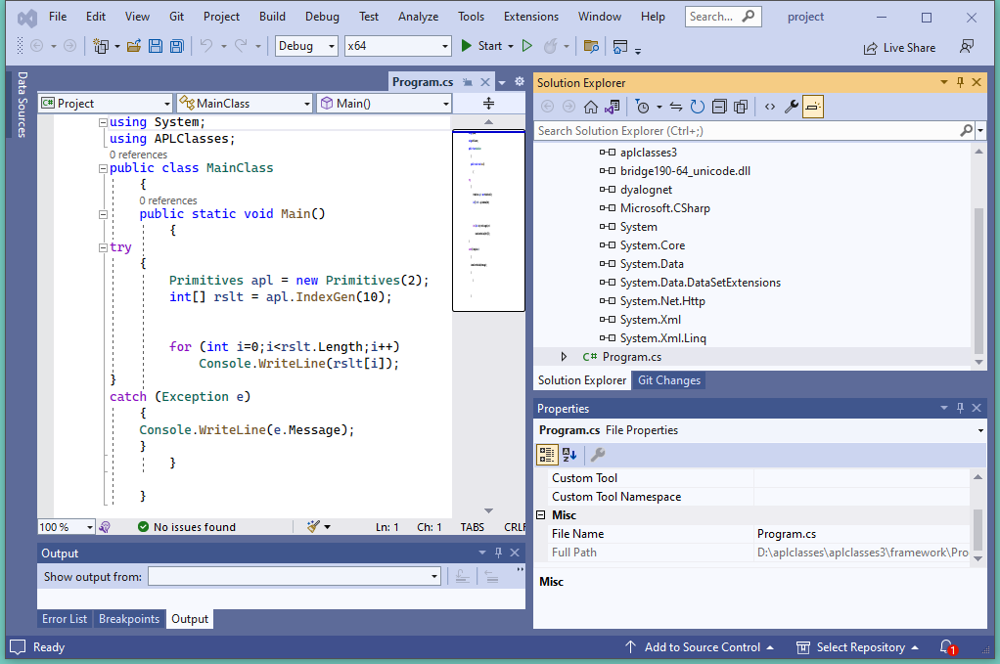
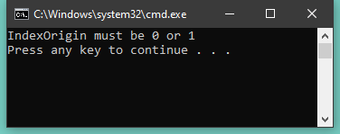

<h1 class="heading"><span class="name">Example 3</span></h1>

The correct .NET behaviour when an APL function fails with an error is to *throw an exception*, and this example shows how to do it.

In the .NET Framework, exceptions are implemented as .NET Classes. The base exception is implemented by the `System.Exception` class, but there are a number of super classes, such as `System.ArgumentException` and `System.ArithmeticException` that inherit from it.

`⎕SIGNAL` may be used to *throw an exception*. To do so, its right argument should be 90 and its left argument should be an object of type `System.Exception` or an object that inherits from `System.Exception`.

When you create the instance of the `Exception` class, you may specify a string (which will turn up in its `Message` property) containing information about the error.

`aplclasses3.dws` contains an improved version of the  `CTOR` constructor function.
```apl
    
     ∇ CTOR IO;EX
[1]   :Access public
[2]   :Signature CTOR Int32 IO
[3]   :Implements constructor
[4]   :If IO∊0 1
[5]      ⎕IO←IO
[6]   :Else
[7]      EX←⎕NEW ArgumentException,⊂⊂'IndexOrigin must be 
                                      0 or 1'
[8]      EX ⎕SIGNAL 90
[9]   :EndIf
     ∇

```

Load `aplclasses3.dws` and export  `aplclasses3.dll` as before.





## program.cs

The following C# source, called `aplclasses2\Framework\program.cs`,  contains code to catch the exception and to display the exception message.
```cs
using System;
using APLClasses;
public class MainClass
	{
	public static void Main()
		{
try
	{
		Primitives apl = new Primitives(2);
		int[] rslt = apl.IndexGen(10);

		for (int i=0;i<rslt.Length;i++)
			Console.WriteLine(rslt[i]);
}
catch (Exception e)
	{
	Console.WriteLine(e.Message);
	}
		}

	}	
```

Using VS, open the solution file `d:\aplclasses\aplclasses3\Framework\project.sln` and view `program.cs`.



Click *Debug/Start Without debugging* (or press <kbd>Ctrl</kbd>+<kbd>F5</kbd>) to run the program. The results are shown in a console window.


