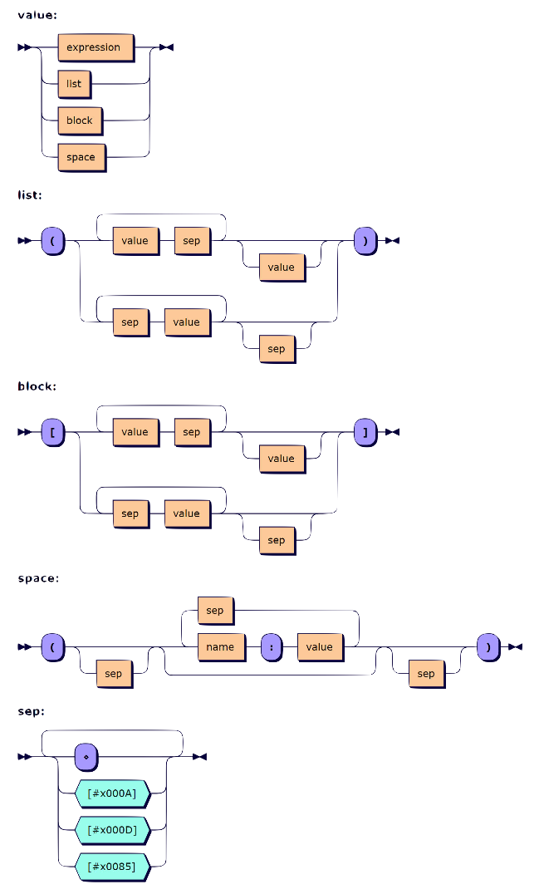

# Array Notation

Array notation extends [vector notation](vector-notation.md) to define arrays of higher rank, and namespaces, and lets these definitions span multiple lines:

-   **Parentheses** embrace vector definitions and namespace name-value pairs
-   **Square brackets** embrace higher-rank arrays
-   **Diamonds** and **linebreaks** separate array elements and name-value pairs

## Examples

Some examples of different kinds of arrays defined with array notation.

### Nested Vector { .example }

```apl
      ⍴z← (0 6 1 8 ⋄ 2*0 2 0 2 1  ⍝ four-element vector over two lines
      2 7 1 8 2 8 ⋄ 3 1 4 1 5)
4
      z
┌───────┬─────────┬───────────┬─────────┐
│0 6 1 8│1 4 1 4 2│2 7 1 8 2 8│3 1 4 1 5│
└───────┴─────────┴───────────┴─────────┘
      ('Three'
       'Blind'
       'Mice')
┌─────┬─────┬────┐
│Three│Blind│Mice│
└─────┴─────┴────┘
      (,⊂'Three') ≡ ('Three' ⋄)  ⍝ single-element vector
1
```

### Matrix { .example }

```apl
      ⍴m←[0 6 1 8 ⋄ 1 4 1 4
       2 7 1 8 ⋄ 3 1 4 2]
4 4
      m
0 6 1 8
1 4 1 4
2 7 1 8
3 1 4 2
```

Short items are padded.
(See [Mix](../../../language-reference-guide/primitive-functions/mix.md) for details.)

```apl
      ⍴mice←['Three'
             'Blind'
             'Mice']
3 5
      mice,'|'
Three|
Blind|
Mice |

      ⍴RC←[0 'OK'
           1 'WS FULL'
           2 'SYNTAX ERROR'
           3 'INDEX ERROR'
           4 'RANK ERROR']
5 2
      ⍴expenses←0⌿[    ⍝ typed template matrix
      'Glasgow' 125.84
      ]
0 2
```

### Column Matrix { .example }

```apl
      [ 1 ⋄ 2 ⋄ 3 ]
1
2
3
      ⍴¨cm3←[('Three' ⋄)
             ('Blind' ⋄)
             ('Mice'  ⋄)]
5
5
4
      cm3
┌─────┐
│Three│
├─────┤
│Blind│
├─────┤
│Mice │
└─────┘
```

### Rank-3 Array { .example }

```apl
      ⍴block←[
       [3 1 4 ⋄ 1 5 ]
       [2 7 0 ⋄ 2]
      ]
2 2 3
      block
3 1 4
1 5 0

2 7 0
2 0 0

```

## Namespaces

Array notation allows you to write a namespace literal as zero or more name-value pairs, spanned by parentheses.

```apl
      ()                       ⍝ empty namespace
#.[Namespace]
      ()()                     ⍝ vector of empty namespaces
 #.[Namespace]  #.[Namespace]
      ( () ⋄ () )              ⍝ vector of empty namespaces
 #.[Namespace]  #.[Namespace]

      n←(x:'hello')
      n.x
hello

      m←(x:['hello'
        'world'])
      ⍴≢m.x                    ⍝ matrix
2

      (y:(x:'hello'))          ⍝ nested namespaces
#.[Namespace]

      (
        FirstName:'Wolfgang'
        LastName:'Mozart'
        Age:35
      )
#.[Namespace]
```

### Scoping In Namespace Literals

Array and namespace literals can include value expressions.

```apl
      LUE←(answer:7×6)   ⍝ Life, the Universe, and Everything
```

Any expressions are evaluated in the scope around the namespace.

```apl
      long←'bobby'
      short←'jack'
      ns←(short:'jill' ⋄ inner:short∘.=short←3↑long)
      ns.inner
1 0 1
0 1 0
1 0 1
      short     ⍝ altered by inner assignment
bob
      ns.short  ⍝ unaffected by inner assignment
jill
      (y:(x:'hello')).y  ⍝ inner namespace's parent is NOT outer namespace
#.[Namespace]
```

## Specification

The new syntactic forms were previously errors in every mainstream APL implementation and therefore introduce no backward incompatibilities, except in a defined function that contains an unmatched parenthesis or bracket, as described in [Defined Functions](#defined-functions).

In the following:

-   A *name-value pair* is an APL name followed by a colon and a value expression.
-   A *separator* is a diamond or line break, and *separated* means separated by them.
-   An *empty* value expression or name-value pair is two separators with nothing but white space between them.

### Namespace

A namespace is defined by a parenthesised, separated list of zero or more name-value pairs.

Empty name-value pairs define no namespace members.

### Vector

A vector is defined by a parenthesised, separated list of two or more value expressions.

Empty value expressions define no vector elements.

At least one value expression must be non-empty.

### Matrices And Higher-rank Arrays

An array of rank 2 or higher is defined by a bracketed, separated list of two or more value expressions, which constitute the major cells of the array.

Short elements are padded to fill, and scalars are treated as length-1 vectors.

At least one value expression must be non-empty.

!!! info "Information"

    Separators in a list of value expressions or name-value pairs make an enclosing parenthesis or bracket *broken*.

    Separators encapsulated in a dfn or further contained in array notation do not break a parenthesis or bracket.
    For example, in

        ({1=⍵:'y' ⋄ 'n'}?2)

    the diamond is part of the dfn and does not break the surrounding parenthesis.

### Defined Functions

A line break in a defined function is a separator, so a parenthesis or bracket that is still open at the end of a line continues onto the following lines until it is closed, and those lines form a single statement:

```apl
      ⎕VR'F'
     ∇ r←F
[1]    r←(1 2
[2]        3 4)
     ∇
      F
 1 2  3 4
```

This affects a defined function that contains an unmatched parenthesis or bracket:

- A dfn or dop does not fix: [`⎕FX`](../../../language-reference-guide/system-functions/fx.md) returns an integer instead of the name, and [`⎕FIX`](../../../language-reference-guide/system-functions/fix.md) reports that the function could not be fixed.
- A tradfn or tradop fixes, and the unmatched parenthesis or bracket is reported as a `SYNTAX ERROR` when its line is executed. An opening parenthesis or bracket on one line and a closing one on a later line, however, form a single statement, so lines that would each give an error on their own run together without one.

### Unsupported

The following are not supported by array notation:

-   scripted and external objects
-   non-array namespace members
-   reference loops
-   class instances
-   internal representations returned by `⎕OR`

While one can include the last three items when writing in array notation, they cannot be displayed in the notation.

### Formal Syntax

The array notation can be described in this form, where `expression` is any traditional APL expression:

    value ::= expression | list | block | space
    list  ::= '(' ( ( value sep )+ value? | ( sep value )+ sep? ) ')'
    block ::= '[' ( ( value sep )+ value? | ( sep value )+ sep? ) ']'
    space ::= '(' sep? ( name ':' value ( sep name ':' value )* )? sep? ')'
    sep   ::= [⋄#x000A#x000D#x0085]+


<!-- Eventually replace with Mermaid diagram. -->
