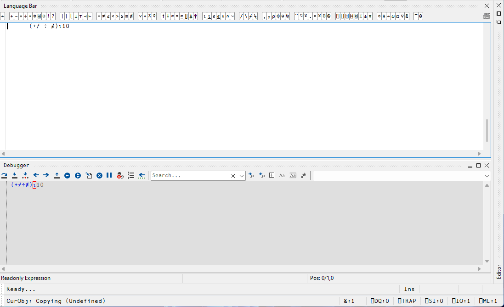

<h1 class="heading"><span class="name">Inline Tracing</span></h1>

*Inline Tracing* is an extension to the Tracer that allows you to step through the execution of individual primitives within expressions, examining intermediate results and arguments of sub-expressions. It enables an in-depth inspection of complex expressions typed directly into the session, and can be used in conjunction with the traditional tracing mode to skip over lines you're not interested in and step through primitive-by-primitive in complex expressions where required.

!!! note
    _Inline Tracing_ is tracing with the (approximate) granularity of primitives, though it does stop on non-primitives, such as user-defined functions.

## Getting started

There is a command **&lt;IT&gt;** called *Inline Trace* with the default keyboard shortcut <kbd>ctrl</kbd>+<kbd>alt</kbd>+<kbd>enter</kbd> which is used to trace inline.

To start inline tracing, position the cursor within an expression and do one of the following:

- enter the _Inline Trace_ command (**&lt;IT&gt;**) in the session.
- select **Action > Trace Inline…** from the Session menu bar.
- select **Action > Trace Inline…** from the Session window's context menu.
- click the **Next Primitive** icon <span class="toolbar-icon" style="background-position: -432px 0"></span> in the Tracer toolbar.

The Tracer opens with primitive tracing activated.

<h2 class="example">Example</h2>

In a Session, enter the expression `(+/÷≢)⍳10` and start inline tracing.



The red outline around the `⍳` in the Tracer shows the next primitive to be executed. Enter **&lt;IT&gt;** or click the **Next Primitive** icon in the Tracer toolbar to see how the execution progresses through the expression.

The **Next Primitive** icon is always present in the Tracer. The **&lt;IT&gt;** command lets you open a Tracer on an expression that has been typed directly in the Session.

### Aspect Panes

When tracing inline, there are several more aspects of an expression that can be inspected beyond the default ones for left and right arguments, available under the **Windows** menu in the Tracer. These are divided into two sections; items 1-4 apply to the current function, and items 5-9 apply to the previously-executed function. They are:

1. **Left Argument**

    As you step through an expression, this displays the left argument that is about to be passed to the highlighted function. Enabled (but minimised) by default.  

2. **Current Function**

    The function that is highlighted with a red outline in the Tracer. Opening a dedicated aspect pane allows you to select different presentation modes; see [Aspect Pane Options](#aspect-pane-options) for more information.

3. **Right Argument**

    As you step through an expression, this displays the right argument that is about to be passed to the highlighted function. Enabled (but minimised) by default. 
    
4. **Axis Specification**

    The bracket axis applied to the current function (if any).

5. **Previous Result**
    
    The result of the function evaluation immediately before the highlighted function.

6. **Previous Left**

    The left argument of the function evaluation immediately before the highlighted function.

7. **Previous Function**

    The function that was evaluated immediately before the highlighted function. 

8. **Previous Right**

    The right argument of the function evaluation immediately before the highlighted function.

9. **Previous Axis**

    The bracket axis applied to the function evaluation immediately before the highlighted function (if any).

The relationship between these panes can be illustrated as

```other
     Left Arg  ┐     ┌─  Axis Specification
               │ ┌─┐ │  ┌──────┬─  Right Arg / Prev Result
               a │B│[1] c D[2] e
                 └┬┘    │ │ │  └  Previous Right
Current Function  ┘     │ │ └  Previous Axis
         Previous Left  ┘ └  Previous Function
```

!!! note 
    Each of these options corresponds to a new pane in the Tracer. Having all panes enabled and visible can result in the interface becoming cluttered and information being hard to locate; Dyalog Ltd recommends enabling these on a case-by-case basis.

### Aspect Pane Options

When a docked aspect pane is the focus, the Session's **Options** menu enables configuration of the behaviour of that aspect pane (for floating panes, the **Options** menu is within the aspect pane). The options are:

- **Show Status Bars**

    Whether status bars are displayed beneath the aspect pane.

- **Minimise until first use**
    
    Whether a saved layout should minimise aspect panes until they are activated. For complex layouts this can improve usability.

- **Show functions as trees**

    When using the **Current/Previous Function** panes, whether **Show functions as trees** uses the same display mode as `]Boxing on -trains=tree`. If this option is not selected, the display mode is `]Boxing on -trains=box`. This can be helpful when investigating tacit expressions. 

- **Trace idioms**

    Whether specific expressions that the interpreter might treat as special cases (for example, idioms) are included when tracing inline. If this option is not selected, such expressions are treated as atomic functions.
 
- **Use Array Notation**

    Whether APL array notation is used to display arguments and results.

The following screenshot illustrates the effect of choosing **Show functions as trees** on the **Current Function** pane:


## Tracing Diamond-Separated Expressions

A line of code can comprise a set of expressions separated by diamonds. In this situation, you might only want to trace into some of them and skip others; this can be done by using the command **&lt;ER&gt;** (by default, this is <kbd>enter</kbd>).

For example, consider a line that consists of three diamond-separated expressions; you want to skip the first two, and trace into the third one:

```apl
a ← 3 3⍴⍳9 ⋄ b ← ⍉a ⋄ a + b
```

Enter the expressions in the Session, and start inline tracing. You should see:


with the first expression highlighted (red outline). Enter **&lt;ER&gt;** (<kbd>enter</kbd>) to execute the single expression before the first diamond separator:


The second expression is now highlighted. Enter **&lt;ER&gt;** (<kbd>enter</kbd>) again to execute the second expression, then enter **&lt;IT&gt;** (<kbd>ctrl</kbd>+<kbd>alt</kbd>+<kbd>enter</kbd>) to start tracing the primitives in the third expression:


